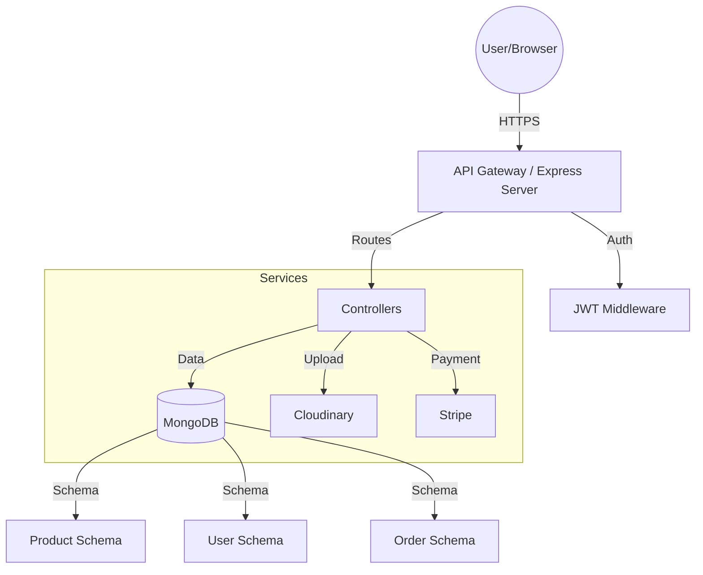

# E-commerce Backend Design

This document outlines the proposed backend architecture and API design for the e-commerce application.

## 1. Technology Stack

- **Runtime:** Node.js
- **Framework:** Express.js (or Next.js API Routes for serverless)
- **Database:** MongoDB (NoSQL) with Mongoose for flexible product schemas.
- **Authentication:** JSON Web Tokens (JWT) + bcrypt for password hashing.
- **File Storage:** Cloudinary (for high-fidelity product images).
- **Payment Gateway:** Stripe API integration.

## 2. System Architecture

## 3. Database Schema Design

### User Model

- `id`: ObjectId
- `name`: String
- `email`: String (Unique)
- `password`: String (Hashed)
- `role`: Enum ['user', 'admin']
- `wishlist`: Array [ProductId]

### Product Model

- `id`: ObjectId
- `name`: String
- `category`: String
- `price`: Number
- `oldPrice`: Number
- `tag`: String
- `image`: String (Cloudinary URL)
- `description`: String
- `features`: Array [String]
- `specs`: Object (Key-Value pairs)
- `stock`: Number

### Order Model

- `id`: ObjectId
- `userId`: ObjectId (Ref User)
- `items`: Array [{ productId, quantity, price }]
- `totalAmount`: Number
- `status`: Enum ['pending', 'paid', 'shipped', 'delivered']
- `shippingAddress`: Object
- `paymentIntentId`: String (Stripe)

## 4. API Endpoints

### Products

- `GET /api/products`: Fetch all products (with filtering/sorting).
- `GET /api/products/:id`: Fetch single product details.
- `POST /api/products`: Create new product (Admin only).
- `PATCH /api/products/:id`: Update product (Admin only).

### Authentication

- `POST /api/auth/register`: User registration.
- `POST /api/auth/login`: User login + Token generation.
- `GET /api/auth/me`: Get current user profile.

### Cart & Orders

- `GET /api/orders`: Fetch user order history.
- `POST /api/orders/checkout`: Create a Stripe checkout session.
- `POST /api/webhook/stripe`: Listen for payment success events.

## 5. Scalability & Performance

- **Caching:** Redis for caching high-traffic product details.
- **CDN:** Use Cloudinary's edge delivery for lightning-fast image loading.
- **Indexing:** MongoDB indexing on `category` and `name` for optimized search.
